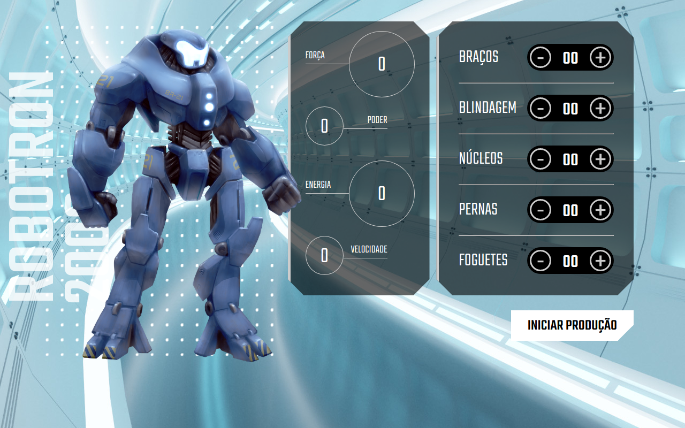

# Robotron-2000
Projeto desenvolvido em paralelo com o curso da Formação JavaScript para frontend- JavaScript: manipulando o DOM.

    

## Requisitos

Nenhum.

## Linguagem & ferramentes
- HTML
- CSS
- JavaScript

## Deploy e acesso

  

